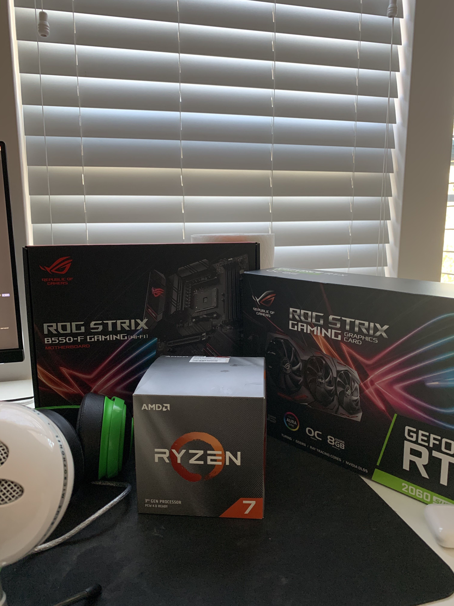

# Build Photos

This directory contains visual documentation of the system at key stages of the build process.  
Photos are included for verification, assembly reference, and hardware validation purposes.

---

## Included Images

### 1. Parts Overview
**File:** [`parts.jpg`](./parts.jpg)

Shows the primary system components prior to assembly, including:
- Motherboard
- CPU
- Graphics card

Purpose:
- Confirms component selection
- Documents hardware used in the build
- Provides traceability between parts and final system

### 2. Internal Build View
**File:** [`inside_desktop_view.jpg`](./inside_desktop_view.jpg)

Shows the internal layout of the assembled system with the side panel removed, including:
- CPU cooler and pump placement
- GPU installation and power delivery
- Cable routing and airflow layout
- Case fan configuration

Purpose:
- Verifies correct installation and seating of components
- Demonstrates airflow and cooling configuration
- Documents internal condition of the system during operation

**Note:** The system is normally configured with two memory modules installed (dual-channel).  
One memory module was temporarily removed during troubleshooting and benchmarking to isolate variables and validate system stability.

---

### 3. Finished System
**File:** [`finished_build.jpg`](./finished_build.jpg)

Shows the completed system with the side panel installed.

Purpose:
- Confirms final assembly state
- Documents the operational endpoint form factor
- Provides a reference image of the completed build

---

## Notes

- Images are intentionally minimal and functional.
- No cosmetic modifications or aesthetic enhancements are emphasized.
- Photos reflect a real, actively used system rather than a staged or unused build.

These images support the broader goal of documenting endpoint assembly, configuration, and maintenance practices.

